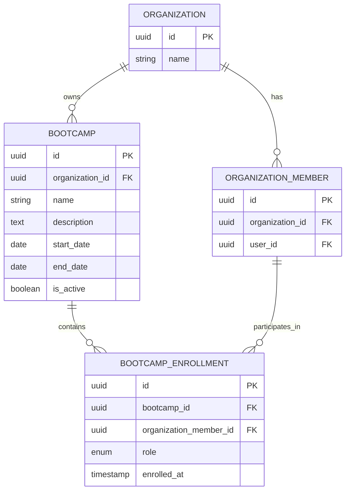

# 1. AUTH API DESIGN: 

| URL                   | Method | Auth            | Description                                                              | Version |
| --------------------- | ------ | --------------- | ------------------------------------------------------------------------ | ------- |
| /auth/signup          | POST   | ❌               | Register a new user using email & password and create a platform account |         |
| /auth/login           | POST   | ❌               | Authenticate user via email & password and issue access + refresh tokens |         |
| /auth/google          | POST   | ❌               | Authenticate or register user using Google OAuth ID token                |         |
| /auth/refresh         | POST   | ❌ (uses cookie) | Generate a new access token using a valid refresh token                  |         |
| /auth/logout          | POST   | ✅               | Invalidate current session by revoking refresh token                     |         |
| /auth/me              | GET    | ✅               | Get currently authenticated user profile                                 |         |
| /auth/forgot-password | POST   | ❌               | Initiate password reset flow by sending reset link to email              |         |
| /auth/reset-password  | POST   | ❌               | Reset password using secure reset token                                  |         |
| /auth/verify-email    | POST   | ❌               | Verify user email using verification token                               | v2      |

---
## 1. SIGNUP : 

#### URL

`POST /auth/signup`

#### Purpose

Create a new user account using email/password.

#### Header : 

```http
Content-Type: application/json
```
#### Request Body:

```json
{
  "name": "Suraj",
  "email": "suraj@example.com",
  "password": "StrongPassword123"
}
```
#### Validation Rule : 

- name: 2–100 chars
- email: valid format, unique
- password:
	- min 8 chars
	- at least 1 letter + 1 number

#### Response Body :

```json
{
  "success": true,
  "data": {
    "user": {
      "id": "user_123",
      "name": "Suraj",
      "email": "suraj@example.com",
      "emailVerified": false
    }
  }
}
```
#### Status : `201 Created`


## 2. LOGIN :

#### URL : 
`POST /auth/login`

#### Purpose
Authenticate user and issue tokens.

#### Request Body
```json
{
  "email": "suraj@example.com",
  "password": "StrongPassword123"
}
```

#### Success Response : 
```json
{
  "success": true,
  "data": {
    "accessToken": "jwt_token",
	"refreshToken": "refresh_token",
    "user": {
      "id": "user_123",
      "name": "Suraj",
      "email": "suraj@example.com"
    }
  }
}
```

#### Access Token Cookie :
```http
Set-Cookie: access_token=<JWT>;
Path=/;
HttpOnly;
Secure;
SameSite=Strict;
Max-Age=900;
```
#### Token Behaviour : 
- Access token → response body and HttpOnly cookie
- Refresh token → HttpOnly cookie


#### Error : 
| Status | Code                |
| ------ | ------------------- |
| 400    | VALIDATION_ERROR    |
| 401    | INVALID_CREDENTIALS |
| 403    | EMAIL_NOT_VERIFIED  |


## 3. GOOGLE AUTH : V2

#### URL
`POST /auth/google`

#### Purpose
Login or signup using Google OAuth.

#### Request Body 
```json
{
  "idToken": "google_id_token"
}
```

#### Behavior
- Verify token with Google
- If user exists → login
- Else → create user

#### Success Response
```json
{
  "success": true,
  "data": {
    "accessToken": "jwt_token",
    "user": {
      "id": "user_123",
      "name": "Suraj",
      "email": "suraj@gmail.com"
    }
  }
}
```


#### Error : 
| Status | Code                 |
| ------ | -------------------- |
| 401    | INVALID_GOOGLE_TOKEN |


## 4. REFRESH TOKEN :

#### URL
`POST /auth/refresh`

#### Purpose
Generate new access token.

#### Headers
Cookie required:
```HTTP
refresh_token=xyz
```

#### Success Response
```json
{
  "success": true,
  "data": {
    "accessToken": "new_jwt_token"
  }
}
```

#### Behavior
- Validate refresh token (DB lookup)
- Rotate refresh token (recommended)


#### Errors :
| Status | Code                  |
| ------ | --------------------- |
| 401    | INVALID_REFRESH_TOKEN |
| 401    | EXPIRED_REFRESH_TOKEN |


## 5. LOGOUT : 

#### URL
`POST /auth/logout`

#### Purpose
Invalidate session.

#### Headers
`Authorization: Bearer <token>`

#### Behavior
- Delete refresh token from DB
- Clear cookie


#### Success Response : 
```json
{
  "success": true,
  "data": {}
}
```


## 6. GET CURRENT USER 

#### URL
`GET /auth/me`

#### Purpose
Fetch authenticated user profile.

#### Success Response
```JSON
{
  "success": true,
  "data": {
    "id": "user_123",
    "name": "Suraj",
    "email": "suraj@example.com",
    "avatarUrl": null
  }
}
```


## 7. FORGOT PASSWORD

#### URL
`POST /auth/forgot-password`

#### Purpose
Send password reset link.

#### Behavior
- Always return success (avoid email enumeration)

#### Request
```JSON
{
  "email": "suraj@example.com"
}
```

#### Response
```JSON
{
  "success": true,
  "data": {}
}
```


## 8. RESET PASSWORD : 

#### URL
`POST /auth/reset-password`

#### Request 
```json
{
  "token": "reset_token",
  "newPassword": "NewPassword123"
}
```

#### Success Response :
```json
{
  "success": true,
  "data": {}
}
```


## 9. VERIFY EMAIL : V2


---

# 2. Organization API

| NO  | URL                             | Method | Auth            | Description                   |     |
| --- | ------------------------------- | ------ | --------------- | ----------------------------- | --- |
| 1   | `/orgs`                         | POST   | USER            | Create org (pending approval) |     |
| 2   | `/orgs`                         | GET    | USER            | List orgs user belongs to     |     |
| 3   | `/orgs/{slug}`                  | GET    | USER            | Get org details               |     |
| 4   | `/orgs/{slug}`                  | PATCH  | ADMIN           | Update org details            |     |
| 5   | `/orgs/{slug}/members`          | GET    | ADMIN / MENTORS | List members                  |     |
| 6   | `/orgs/{slug}/members`          | POST   | ADMIN / MENTORS | Add member                    |     |
| 7   | `/orgs/{slug}/members/{userId}` | PATCH  | ADMIN           | Update member role            |     |
| 8   | `/orgs/{slug}/members/{userId}` | DELETE | ADMIN/MENTOR    | Remove member                 |     |
| 9   | `/orgs/{slug}/join`             | POST   | USER            | Request/join org              |     |
| 10  | `/orgs/{slug}/leave`            | POST   | USER            | Leave org                     |     |
| 11  | `/orgs/pending`                 | GET    | SUPER_ADMIN     | View pending orgs             |     |
| 12  | `/orgs/{id}/approve`            | POST   | SUPER_ADMIN     | Approve org                   |     |
| 13  | `/orgs/{id}/suspend`            | POST   | SUPER_ADMIN     | Suspend org                   |     |

## 1. CREATE ORGANIZATION : `POST /orgs`

#### **Purpose:** 
- Use to Create organization.
- pending approval from SUPER_ADMIN

#### **Access Control**
- Any authenticated USER

#### Header : 
```http
Authorization: Bearer <token>
```

#### Request Body : 
```json
{
  "name": "Algo University",
  "slug": "algo-university",
  "description": "DSA focused bootcamp"
}
```

#### Validation  :
```json
{
  "name": "Algo University",
  "slug": "algo-university",
  "description": "DSA focused bootcamp"
}
```


#### Success Response : 
```json
{
  "id": "org_uuid",
  "status": "PENDING_APPROVAL"
}
```


#### Error 
|Status|Code|Condition|
|---|---|---|
|409|ORG_SLUG_EXISTS|slug taken|
|400|INVALID_INPUT|bad slug|


### 2. GET ORGANIZATION :  GET `/orgs`

#### Purpose : 
- List all the orgs that user belongs to.

#### Access Control :
- USER

## 3. GET ORGANIZATION :  `GET /orgs/{slug}`

#### Purpose
- Get details of the organization.

#### Access Control
- Only members of the organization : MENTEE, MENTOR, ADMIN, SUPER_ADMIN


# 3. BOOTCAMP API : 

| #   | URL                                                          | Method | Auth                                   | Description                                                               |
| --- | ------------------------------------------------------------ | ------ | -------------------------------------- | ------------------------------------------------------------------------- |
| 1   | `/orgs/{org_id}/b`                                           | POST   | super_admin, org_admin                 | Create a bootcamp inside an organization                                  |
| 2   | `/orgs/{org_id}/b`                                           | GET    | super_admin, org_admin, mentor, mentee | List bootcamps for an organization                                        |
| 3   | `/orgs/{org_id}/b/{bootcamp_id}`                             | GET    | super_admin, org_admin, mentor, mentee | Get bootcamp details                                                      |
| 4   | `/orgs/{org_id}/b/{bootcamp_id}`                             | PATCH  | org_admin                              | Update bootcamp metadata or active state                                  |
| 5   | `/orgs/{org_id}/b/{bootcamp_id}/enrollments`                 | GET    | super_admin, org_admin, mentor,mentee  | List bootcamp participants                                                |
| 6   | `/orgs/{org_id}/b/{bootcamp_id}/enrollments`                 | POST   | org_admin                              | Enroll an org member into the bootcamp                                    |
| 7   | `/orgs/{org_id}/b/{bootcamp_id}/enrollments/{enrollment_id}` | PATCH  | org_admin                              | Change participant role or status.<br>mentee -> mentor<br>mentor -> admin |
| 8   | `/orgs/{org_id}/b/{bootcamp_id}/enrollments/{enrollment_id}` | DELETE | org_admin                              | Remove a participant from the bootcamp                                    |
## 1. GLOBAL BEHAVIOR



## 1. CREATE BOOTCAMP : `POST /orgs/{org_id}/b`


**Purpose:** Create a new bootcamp under the given organization.
**Access Control:** `super_admin`, `org_admin`
- `org_admin` can only create bootcamps in their own organization.
- `super_admin` can create anywhere.

**Headers**
- `Authorization: Bearer <token>`
- `Idempotency-Key: <optional>` for retry-safe creation

**Path Params**
- `org_id` — organization UUID

#### Request body :
```json
{
  "name": "8 Week DSA Bootcamp",
  "description": "Core DSA cohort for new learners",
  "start_date": "2026-04-01",
  "end_date": "2026-05-27",
  "is_active": true
}
```
**Validation Rules**

- `name` required, trimmed, 3–120 chars
- `description` optional, max e.g. 2000 chars
- `start_date` and `end_date` optional
- if both dates exist, `start_date <= end_date`
- `is_active` defaults to `true` if omitted

**Success Response**

- `201 Created`

```json
{
  "id": "bootcamp_uuid",
  "organization_id": "org_uuid",
  "name": "8 Week DSA Bootcamp",
  "description": "Core DSA cohort for new learners",
  "start_date": "2026-04-01",
  "end_date": "2026-05-27",
  "is_active": true,
  "created_at": "2026-03-21T10:00:00Z",
  "updated_at": "2026-03-21T10:00:00Z"
}
```

**Error :**

|Status|Code|Condition|
|---|---|---|
|400|invalid_body|Malformed JSON or validation failure|
|401|unauthorized|Missing/invalid token|
|403|forbidden|Caller cannot manage this org|
|404|org_not_found|Organization does not exist|
|409|duplicate_bootcamp_name|Same org already has conflicting bootcamp name, if you enforce that rule|


## 2. LIST BOOTCAMPS : `GET /orgs/{org_id}/b`


**Purpose:** 
- List bootcamps within an organization.

**Access Control:**
- `super_admin`, `org_admin`, `mentor`, `mentee`

**Headers**
- `Authorization: Bearer <token>`

**Path Params**
- `org_id` — organization UUID

**Query Params**
- `q` — search by name
- `is_active` — `true|false`
- `page`, `limit`

**Success Response**
- `200 OK`

```json
{
  "items": [
    {
      "id": "bootcamp_uuid",
      "name": "8 Week DSA Bootcamp",
      "is_active": true,
      "start_date": "2026-04-01",
      "end_date": "2026-05-27"
    }
  ],
  "page": 1,
  "limit": 20,
  "total": 1
}
```


#### Error :
| Status | Code          | Condition                             |
| ------ | ------------- | ------------------------------------- |
| 401    | unauthorized  | Missing/invalid token                 |
| 403    | forbidden     | Caller is not allowed to see this org |
| 404    | org_not_found | Organization does not exist           |

## 3. GET BOOTCAMP DETAILS :  `GET /orgs/{org_id}/b/{bootcamp_id}`


**Purpose:** Fetch one bootcamp with full metadata.

**Access Control:** `super_admin`, `org_admin`, `mentor`, `mentee`
- The caller must belong to the org, or be super admin.
- If you want stricter access, require the caller to be an org member.

**Headers**
- `Authorization: Bearer <token>`

**Path Params**
- `org_id` — organization UUID
- `bootcamp_id` — bootcamp UUID

**Success Response**
- `200 OK`

```json
{  
  "id": "bootcamp_uuid",  
  "organization_id": "org_uuid",  
  "name": "8 Week DSA Bootcamp",  
  "description": "Core DSA cohort for new learners",  
  "start_date": "2026-04-01",  
  "end_date": "2026-05-27",  
  "is_active": true,  
  "created_at": "2026-03-21T10:00:00Z",  
  "updated_at": "2026-03-21T10:00:00Z"  
}
```

**Errors**

|Status|Code|Condition|
|---|---|---|
|401|unauthorized|Missing/invalid token|
|403|forbidden|Bootcamp does not belong to this org or caller has no access|
|404|bootcamp_not_found|Bootcamp does not exist|


## 4. UPDATE BOOTCAMP : `PATCH /orgs/{org_id}/b/b{bootcamp_id}`

**Purpose:** Update bootcamp metadata or active state.
**Access Control:** `org_admin`

**Headers**
- `Authorization: Bearer <token>`

**Path Params**
- `org_id` — organization UUID
- `bootcamp_id` — bootcamp UUID

**Request Body**
```json
{
  "name": "Backend Engineering Cohort",
  "description": "Cohort for Go and system design",
  "start_date": "2026-04-10",
  "end_date": "2026-06-10",
  "is_active": false
}
```

**Validation Rules**

- All fields optional, but at least one must be present
- `name` if present: 3–120 chars
- `description` if present: max length enforced
- dates must be valid and ordered
- `is_active` toggles availability for new enrollment

**Success Response**

- `200 OK`
```json
{
  "id": "bootcamp_uuid",
  "organization_id": "org_uuid",
  "name": "Backend Engineering Cohort",
  "description": "Cohort for Go and system design",
  "start_date": "2026-04-10",
  "end_date": "2026-06-10",
  "is_active": false,
  "updated_at": "2026-03-21T10:20:00Z"
}
```

#### Error : 
| Status | Code                     | Condition                                      |
| ------ | ------------------------ | ---------------------------------------------- |
| 400    | invalid_body             | No valid fields or bad data                    |
| 401    | unauthorized             | Missing/invalid token                          |
| 403    | forbidden                | Caller cannot manage this org                  |
| 404    | bootcamp_not_found       | Bootcamp does not exist                        |
| 409    | invalid_state_transition | Example: trying to activate with invalid dates |

## 5. LIST ENROLLMENTS : `GET /orgs/{org_id}/b/{bootcamp_id}/enrollments`


**Purpose:** List all participants in a bootcamp.

**Access Control:** `super_admin`, `org_admin`, `mentor` `mentee`
- `mentor` can read participants if they are part of the bootcamp or org.

**Headers**
- `Authorization: Bearer <token>`

**Path Params**
- `org_id` — organization UUID
- `bootcamp_id` — bootcamp UUID

**Query Params**
- `role` — `mentor|mentee`
- `page`, `limit`

**Success Response**
- `200 OK`

```JSON
{  
  "items": [  
    {  
      "id": "enrollment_uuid",  
      "bootcamp_id": "bootcamp_uuid",  
      "organization_member_id": "member_uuid",  
      "role": "mentor",  
      "enrolled_at": "2026-03-21T10:00:00Z"  
    }  
  ],  
  "page": 1,  
  "limit": 20,  
  "total": 1  
}
```

**Errors**

|Status|Code|Condition|
|---|---|---|
|401|unauthorized|Missing/invalid token|
|403|forbidden|Caller cannot see this bootcamp|
|404|bootcamp_not_found|Bootcamp does not exist|


## 6. ENROLL MEMBER IN BOOTCAMP : `POST /orgs/{org_id}/b/{bootcamp_id}/enrollments`

**Purpose:** 
- Enroll an organization member into a bootcamp with a bootcamp-specific role.
**Access Control:**
-  `org_admin`

**Headers**
- `Authorization: Bearer <token>`
- `Idempotency-Key: <optional>`

**Path Params**
- `org_id` — organization UUID
- `bootcamp_id` — bootcamp UUID

**Request Body**
```json
{  
  "organization_member_id": "member_uuid",  
  "role": "mentee"  
}
```

**Validation Rules**
- `organization_member_id` required
- `role` required, enum: `mentor | mentee`
- member must belong to the same org as the bootcamp
- bootcamp must be active unless you explicitly allow late joins
- prevent duplicates via unique `(bootcamp_id, organization_member_id)`

**Success Response**
- `201 Created`
```json
{  
  "id": "enrollment_uuid",  
  "bootcamp_id": "bootcamp_uuid",  
  "organization_member_id": "member_uuid",  
  "role": "mentee",  
  "enrolled_at": "2026-03-21T10:30:00Z"  
}
```

**Errors**

|Status|Code|Condition|
|---|---|---|
|400|invalid_body|Bad request or invalid role|
|401|unauthorized|Missing/invalid token|
|403|forbidden|Caller cannot manage this org|
|404|bootcamp_not_found|Bootcamp does not exist|
|404|org_member_not_found|Member does not exist in this org|
|409|duplicate_enrollment|Same member already enrolled|
|409|cross_org_violation|Member belongs to a different organization|
|409|bootcamp_inactive|Enrollment blocked because bootcamp is closed|

## 7. Update Enrollment

**URL:** `PATCH /orgs/{org_id}/b/{bootcamp_id}/enrollments/{enrollment_id}`

**Purpose:** 
- Change a participant’s bootcamp role or status-related fields.
- Org Admin can use it to promote a member (mentee) to mentor 

**Access Control:** `org_admin`

**Headers**
- `Authorization: Bearer <token>`

**Path Params**
- `org_id` — organization UUID
- `bootcamp_id` — bootcamp UUID
- `enrollment_id` — enrollment UUID

**Request Body**
```json
{  
  "role": "mentor"  
}
```

**Validation Rules**
- `role` optional but if present must be `mentor|mentee`
- enrollment must belong to the given bootcamp
- org must match
- if you later add `is_active` to enrollment, keep the same pattern here

**Success Response**
- `200 OK`

```json
{  
  "id": "enrollment_uuid",  
  "bootcamp_id": "bootcamp_uuid",  
  "organization_member_id": "member_uuid",  
  "role": "mentor",  
  "enrolled_at": "2026-03-21T10:00:00Z"  
}
```

**Errors**

|Status|Code|Condition|
|---|---|---|
|400|invalid_body|Invalid role or empty patch|
|401|unauthorized|Missing/invalid token|
|403|forbidden|Caller cannot manage this org|
|404|enrollment_not_found|Enrollment does not exist|
|409|duplicate_enrollment|If changing role collides with an existing enforced rule|


## 8. Remove Enrollment

**URL:** `DELETE /orgs/{org_id}/b/{bootcamp_id}/enrollments/{enrollment_id}`

**Purpose:** 
- Remove a participant from the bootcamp.

**Access Control:** `org_admin`, `mentor`

**Headers**
- `Authorization: Bearer <token>`

**Path Params**
- `org_id` — organization UUID
- `bootcamp_id` — bootcamp UUID
- `enrollment_id` — enrollment UUID

**Success Response**
- `204 No Content`

**Errors**

| Status | Code                      | Condition                                          |
| ------ | ------------------------- | -------------------------------------------------- |
| 401    | unauthorized              | Missing/invalid token                              |
| 403    | forbidden                 | Caller cannot manage this org                      |
| 404    | enrollment_not_found      | Enrollment does not exist                          |
| 409    | cannot_remove_last_mentor | If your business rule requires at least one mentor |


# 4. PROBLEM CONTENT Module 

| #   | URL                                                            | Method | Auth                               | Description                                   |
| --- | -------------------------------------------------------------- | ------ | ---------------------------------- | --------------------------------------------- |
| 1   | `/orgs/{org_id}/problems`                                      | POST   | admin, mentor                      | Create a new problem in the org question bank |
| 2   | `/orgs/{org_id}/problems`                                      | GET    | super_admin, admin, mentor, mentee | List org problems with filters                |
| 3   | `/orgs/{org_id}/problems/{problem_id}`                         | GET    | super_admin, admin, mentor, mentee | Get problem details                           |
| 4   | `/orgs/{org_id}/problems/{problem_id}`                         | PATCH  | admin, mentor                      | Update a problem                              |
| 5   | `/orgs/{org_id}/problems/{problem_id}`                         | DELETE | admin, mentor                      | Delete a problem                              |
| 6   | `/orgs/{org_id}/tags`                                          | POST   | admin, mentor                      | Create a tag in the org                       |
| 7   | `/orgs/{org_id}/tags`                                          | GET    | super_admin, admin, mentor, mentee | List org tags                                 |
| 8   | `/orgs/{org_id}/tags/{tag_id}`                                 | PATCH  | admin, mentor                      | Rename a tag                                  |
| 9   | `/orgs/{org_id}/tags/{tag_id}`                                 | DELETE | admin, mentor                      | Delete a tag                                  |
| 10  | `/orgs/{org_id}/problems/{problem_id}/tags`                    | POST   | admin, mentor                      | Attach tags to a problem                      |
| 11  | `/orgs/{org_id}/problems/{problem_id}/tags/{tag_id}`           | DELETE | admin, mentor                      | Detach a tag from a problem                   |
| 12  | `/orgs/{org_id}/problems/{problem_id}/resources`               | POST   | admin, mentor                      | Add a learning resource to a problem          |
| 13  | `/orgs/{org_id}/problems/{problem_id}/resources`               | GET    | super_admin, admin, mentor, mentee | List problem resources                        |
| 14  | `/orgs/{org_id}/problems/{problem_id}/resources/{resource_id}` | PATCH  | admin, mentor                      | Update a resource                             |
| 15  | `/orgs/{org_id}/problems/{problem_id}/resources/{resource_id}` | DELETE | admin, mentor                      | Remove a resource                             |


## 1. CREATE PROBLEM :

- **URL:** `POST /orgs/{org_id}/problems`
- **Purpose:** Create a reusable problem in the org master question bank.
- **Access Control:** `admin`, `mentor`

#### Headers

- `Authorization: Bearer <token>`
- `Content-Type: application/json`
- Cookie auth may also be accepted if your gateway supports it.

#### Path Params

- `org_id` — organization UUID

#### Request Body

```JSON
{
  "title": "Two Sum",
  "description": "Given an array of integers, return indices of the two numbers such that they add up to a target.",
  "difficulty": "easy",
  "external_link": "https://leetcode.com/problems/two-sum"
}
```

### Validation Rules

- `title` required, trimmed, 3–200 chars
- `description` optional
- `difficulty` required, enum: `easy | medium | hard`
- `external_link` optional, must be a valid URL if present
- caller must be a member of the same organization
- `title` uniqueness inside an org is recommended, but not mandatory unless you want strict dedupe
- `created_by` is derived from the authenticated org member, never accepted from client

#### Success Response

- `201 Created`
```json
{
  "id": "prob_uuid",
  "organization_id": "org_uuid",
  "created_by": "org_member_uuid",
  "title": "Two Sum",
  "description": "Given an array of integers, return indices of the two numbers such that they add up to a target.",
  "difficulty": "easy",
  "external_link": "https://leetcode.com/problems/two-sum",
  "created_at": "2026-03-21T10:00:00Z",
  "updated_at": "2026-03-21T10:00:00Z"
}
```

#### Error :
| Status | Code              | Condition                                            |
| ------ | ----------------- | ---------------------------------------------------- |
| 400    | invalid_body      | Bad JSON or validation failed                        |
| 401    | unauthorized      | Missing or invalid token                             |
| 403    | forbidden         | Caller is not allowed to create problems in this org |
| 404    | org_not_found     | Organization does not exist                          |
| 409    | duplicate_problem | Optional if you enforce title uniqueness             |

## 2. LIST PROBLEMS: 

- **URL:** `GET /orgs/{org_id}/problems`
- **Purpose:** List reusable problems in the org question bank.
- **Access Control:** `super_admin`, `admin`, `mentor`, `mentee`

#### Headers
- `Authorization: Bearer <token>`

#### Path Params
- `org_id` — organization UUID

#### Query Params
- `q` — search by title
- `difficulty` — `easy | medium | hard`
- `tag_id` — filter by tag
- `page`
- `limit`
- `sort_by` — `created_at | title | difficulty`
- `order` — `asc | desc`

#### Success Response
- `200 OK`

```json
{  
  "items": [  
    {  
      "id": "prob_uuid",  
      "title": "Two Sum",  
      "difficulty": "easy",  
      "external_link": "https://leetcode.com/problems/two-sum",  
      "tag_count": 3,  
      "resource_count": 2,  
      "created_at": "2026-03-21T10:00:00Z"  
    }  
  ],  
  "page": 1,  
  "limit": 20,  
  "total": 1  
}
```

#### Errors

|Status|Code|Condition|
|---|---|---|
|401|unauthorized|Missing or invalid token|
|403|forbidden|Caller cannot access this organization|
|404|org_not_found|Organization does not exist|

## 3. GET PROBLEM DETAILS :

- **URL:** `GET /orgs/{org_id}/problems/{problem_id}`
- **Purpose:** Fetch one problem with its tags and resources.
- **Access Control:** `super_admin`, `admin`, `mentor`, `mentee`

#### Headers
- `Authorization: Bearer <token>`

#### Path Params
- `org_id` — organization UUID
- `problem_id` — problem UUID

#### Success Response
- `200 OK`

```json
{  
  "id": "prob_uuid",  
  "organization_id": "org_uuid",  
  "created_by": "org_member_uuid",  
  "title": "Two Sum",  
  "description": "Given an array of integers, return indices of the two numbers such that they add up to a target.",  
  "difficulty": "easy",  
  "external_link": "https://leetcode.com/problems/two-sum",  
  "tags": [  
    {  
      "id": "tag_uuid_1",  
      "name": "arrays"  
    },  
    {  
      "id": "tag_uuid_2",  
      "name": "hash-map"  
    }  
  ],  
  "resources": [  
    {  
      "id": "res_uuid_1",  
      "title": "Official Editorial",  
      "url": "https://example.com/editorial"  
    }  
  ],  
  "created_at": "2026-03-21T10:00:00Z",  
  "updated_at": "2026-03-21T10:00:00Z"  
}
```

#### Errors

|Status|Code|Condition|
|---|---|---|
|401|unauthorized|Missing or invalid token|
|403|forbidden|Org access denied|
|404|problem_not_found|Problem does not exist in this org|


## 4) Update Problem

- **URL:** `PATCH /orgs/{org_id}/problems/{problem_id}`
- **Purpose:** Update problem metadata.
- **Access Control:** `admin`, `mentor`

#### Headers
- `Authorization: Bearer <token>`
- `Content-Type: application/json`

#### Path Params
- `org_id` — organization UUID
- `problem_id` — problem UUID

#### Request Body

```json
{  
  "title": "Two Sum - Optimized",  
  "description": "Updated statement",  
  "difficulty": "easy",  
  "external_link": "https://leetcode.com/problems/two-sum"  
}
```

#### Validation Rules

- all fields optional, but at least one field must be present
- `title` length 3–200 if provided
- `difficulty` enum if provided
- URL must be valid if provided
- problem must belong to the org in path
- do not allow changing `organization_id` or `created_by`

#### Success Response

- `200 OK`
```
{  
  "id": "prob_uuid",  
  "organization_id": "org_uuid",  
  "created_by": "org_member_uuid",  
  "title": "Two Sum - Optimized",  
  "description": "Updated statement",  
  "difficulty": "easy",  
  "external_link": "https://leetcode.com/problems/two-sum",  
  "updated_at": "2026-03-21T10:15:00Z"  
}
```
#### Errors

| Status | Code              | Condition                                 |
| ------ | ----------------- | ----------------------------------------- |
| 400    | invalid_body      | No valid fields or bad values             |
| 401    | unauthorized      | Missing or invalid token                  |
| 403    | forbidden         | Caller cannot update problems in this org |
| 404    | problem_not_found | Problem does not exist                    |
| 409    | duplicate_problem | If title uniqueness is enforced           |


## 5) Delete Problem

- **URL:** `DELETE /orgs/{org_id}/problems/{problem_id}`
- **Purpose:** Remove a problem from the org question bank.
- **Access Control:** `admin`, `mentor`

#### Headers
- `Authorization: Bearer <token>`

#### Path Params
- `org_id` — organization UUID
- `problem_id` — problem UUID

#### Success Response
- `204 No Content`

#### Important rule
Do not hard-delete if the problem is already used in assignments/submissions unless your system has a proper archival strategy. In production, soft delete is usually safer.

#### Errors

|Status|Code|Condition|
|---|---|---|
|401|unauthorized|Missing or invalid token|
|403|forbidden|Caller cannot delete problems in this org|
|404|problem_not_found|Problem does not exist|
|409|problem_in_use|Problem is referenced by assignments or submissions|

---

## 6) Create Tag

- **URL:** `POST /orgs/{org_id}/tags`
- **Purpose:** Create a reusable org tag.
- **Access Control:** `admin`, `mentor`

#### Headers
- `Authorization: Bearer <token>`
- `Content-Type: application/json`

#### Path Params

- `org_id` — organization UUID

#### Request Body
```json
{  
  "name": "sliding-window"  
}
```

#### Validation Rules
- `name` required, trimmed, 2–80 chars
- store normalized form consistently, e.g. lowercase with hyphens
- must be unique per organization
- do not accept `organization_id` from client

#### Success Response
- `201 Created`

```json
{  
  "id": "tag_uuid",  
  "organization_id": "org_uuid",  
  "name": "sliding-window",  
  "created_at": "2026-03-21T10:00:00Z"  
}
```

### Errors

|Status|Code|Condition|
|---|---|---|
|400|invalid_body|Bad request or invalid tag name|
|401|unauthorized|Missing or invalid token|
|403|forbidden|Caller cannot create tags|
|404|org_not_found|Organization does not exist|
|409|duplicate_tag|Tag already exists in this org|

---

## 7) List Tags

- **URL:** `GET /orgs/{org_id}/tags`
- **Purpose:** List all tags in the org.
- **Access Control:** `super_admin`, `admin`, `mentor`, `mentee`

#### Headers
- `Authorization: Bearer <token>`

#### Path Params

- `org_id` — organization UUID

#### Query Params

- `q` — search tag name
- `page`
- `limit`

#### Success Response

- `200 OK`

```json
{  
  "items": [  
    {  
      "id": "tag_uuid",  
      "name": "sliding-window"  
    }  
  ],  
  "page": 1,  
  "limit": 20,  
  "total": 1  
}
```

#### Errors

| Status | Code          | Condition                              |
| ------ | ------------- | -------------------------------------- |
| 401    | unauthorized  | Missing or invalid token               |
| 403    | forbidden     | Caller cannot access this organization |
| 404    | org_not_found | Organization does not exist            |


## 8) Update Tag

- **URL:** `PATCH /orgs/{org_id}/tags/{tag_id}`
- **Purpose:** Rename a tag.
- **Access Control:** `admin`, `mentor`

#### Headers
- `Authorization: Bearer <token>`
- `Content-Type: application/json`

#### Path Params
- `org_id` — organization UUID
- `tag_id` — tag UUID

#### Request Body
```json
{  
  "name": "two-pointers"  
}
```

#### Validation Rules
- `name` required in patch body
- normalized uniqueness enforced within org
- tag must belong to the path org

#### Success Response

- `200 OK`

```json
{  
  "id": "tag_uuid",  
  "organization_id": "org_uuid",  
  "name": "two-pointers",  
  "created_at": "2026-03-21T10:00:00Z"  
}
```
#### Errors

|Status|Code|Condition|
|---|---|---|
|400|invalid_body|Missing or invalid name|
|401|unauthorized|Missing or invalid token|
|403|forbidden|Caller cannot update tags|
|404|tag_not_found|Tag does not exist|
|409|duplicate_tag|Another tag with same name already exists|

---

## 9) Delete Tag

- **URL:** `DELETE /orgs/{org_id}/tags/{tag_id}`
- **Purpose:** Remove a tag from the org.
- **Access Control:** `admin`, `mentor`

#### Headers

- `Authorization: Bearer <token>`

#### Path Params

- `org_id` — organization UUID
- `tag_id` — tag UUID

#### Success Response

- `204 No Content`

#### Important rule

If the tag is attached to problems, you need a business decision:

- either cascade remove from `problem_tags`, or
- reject deletion with `409 tag_in_use`.

For production clarity, I recommend **rejecting delete when in use** unless you explicitly support cleanup.

#### Errors

|Status|Code|Condition|
|---|---|---|
|401|unauthorized|Missing or invalid token|
|403|forbidden|Caller cannot delete tags|
|404|tag_not_found|Tag does not exist|
|409|tag_in_use|Tag is attached to one or more problems|

---

## 10) Attach Tags to Problem

- **URL:** `POST /orgs/{org_id}/problems/{problem_id}/tags`
- **Purpose:** Attach one or more tags to a problem.
- **Access Control:** `admin`, `mentor`

#### Headers

- `Authorization: Bearer <token>`
- `Content-Type: application/json`

#### Path Params

- `org_id` — organization UUID
- `problem_id` — problem UUID

#### Request Body
```
{  
  "tag_ids": [  
    "tag_uuid_1",  
    "tag_uuid_2"  
  ]  
}
```

#### Validation Rules

- `tag_ids` required and must not be empty
- every tag must belong to the same org
- problem must belong to the same org
- duplicates in request should be deduplicated or rejected cleanly
- existing relations should not error unless your API is strict; idempotent attach is better

#### Success Response

- `200 OK`
```
{  
  "problem_id": "prob_uuid",  
  "attached_tag_ids": [  
    "tag_uuid_1",  
    "tag_uuid_2"  
  ]  
}
```
#### Errors

|Status|Code|Condition|
|---|---|---|
|400|invalid_body|Empty list or invalid IDs|
|401|unauthorized|Missing or invalid token|
|403|forbidden|Caller cannot modify this org|
|404|problem_not_found|Problem does not exist|
|404|tag_not_found|One or more tags do not exist in this org|
|409|cross_org_violation|A tag belongs to a different organization|

---

## 11) Detach Tag from Problem

- **URL:** `DELETE /orgs/{org_id}/problems/{problem_id}/tags/{tag_id}`
- **Purpose:** Remove one tag from one problem.
- **Access Control:** `admin`, `mentor`

#### Headers

- `Authorization: Bearer <token>`

#### Path Params

- `org_id` — organization UUID
- `problem_id` — problem UUID
- `tag_id` — tag UUID

#### Success Response

- `204 No Content`

#### Errors

| Status | Code               | Condition                           |
| ------ | ------------------ | ----------------------------------- |
| 401    | unauthorized       | Missing or invalid token            |
| 403    | forbidden          | Caller cannot modify this org       |
| 404    | relation_not_found | Problem-tag relation does not exist |

---

## 12) Add Problem Resource

- **URL:** `POST /orgs/{org_id}/problems/{problem_id}/resources`
- **Purpose:** Add a learning resource to a problem.
- **Access Control:** `admin`, `mentor`

#### Headers

- `Authorization: Bearer <token>`
- `Content-Type: application/json`

#### Path Params

- `org_id` — organization UUID
- `problem_id` — problem UUID

#### Request Body
```
{  
  "title": "Official Editorial",  
  "url": "https://example.com/editorial"  
}
```

#### Validation Rules

- `title` required, 2–150 chars
- `url` required and must be a valid URL
- problem must belong to same org
- no org_id field in body
- resource count can be unlimited unless product policy says otherwise

#### Success Response

- `201 Created`
```
{  
  "id": "res_uuid",  
  "problem_id": "prob_uuid",  
  "title": "Official Editorial",  
  "url": "https://example.com/editorial",  
  "created_at": "2026-03-21T10:30:00Z"  
}
```
#### Errors

| Status | Code              | Condition                     |
| ------ | ----------------- | ----------------------------- |
| 400    | invalid_body      | Bad title or URL              |
| 401    | unauthorized      | Missing or invalid token      |
| 403    | forbidden         | Caller cannot modify this org |
| 404    | problem_not_found | Problem does not exist        |

---

## 13) List Problem Resources

- **URL:** `GET /orgs/{org_id}/problems/{problem_id}/resources`
- **Purpose:** List all resources attached to a problem.
- **Access Control:** `super_admin`, `admin`, `mentor`, `mentee`

#### Headers

- `Authorization: Bearer <token>`

#### Path Params

- `org_id` — organization UUID
- `problem_id` — problem UUID

#### Success Response

- `200 OK`
```
{  
  "items": [  
    {  
      "id": "res_uuid",  
      "title": "Official Editorial",  
      "url": "https://example.com/editorial",  
      "created_at": "2026-03-21T10:30:00Z"  
    }  
  ],  
  "total": 1  
}
```
#### Errors

| Status | Code              | Condition                              |
| ------ | ----------------- | -------------------------------------- |
| 401    | unauthorized      | Missing or invalid token               |
| 403    | forbidden         | Caller cannot access this organization |
| 404    | problem_not_found | Problem does not exist                 |

---

## 14) Update Problem Resource

- **URL:** `PATCH /orgs/{org_id}/problems/{problem_id}/resources/{resource_id}`
- **Purpose:** Update a problem resource.
- **Access Control:** `admin`, `mentor`

#### Headers

- `Authorization: Bearer <token>`
- `Content-Type: application/json`

#### Path Params

- `org_id` — organization UUID
- `problem_id` — problem UUID
- `resource_id` — resource UUID

#### Request Body
```
{  
  "title": "Updated Editorial",  
  "url": "https://example.com/new-editorial"  
}
```
#### Validation Rules

- all fields optional, but at least one must be present
- title/url must be valid if present
- resource must belong to the problem in path
- problem must belong to the org in path

#### Success Response

- `200 OK`
```
{  
  "id": "res_uuid",  
  "problem_id": "prob_uuid",  
  "title": "Updated Editorial",  
  "url": "https://example.com/new-editorial",  
  "created_at": "2026-03-21T10:30:00Z"  
}
```
#### Errors

| Status | Code               | Condition                      |
| ------ | ------------------ | ------------------------------ |
| 400    | invalid_body       | No valid fields or bad values  |
| 401    | unauthorized       | Missing or invalid token       |
| 403    | forbidden          | Caller cannot update resources |
| 404    | resource_not_found | Resource does not exist        |

---

## 15) Delete Problem Resource

- **URL:** `DELETE /orgs/{org_id}/problems/{problem_id}/resources/{resource_id}`
- **Purpose:** Remove a resource from a problem.
- **Access Control:** `admin`, `mentor`

#### Headers

- `Authorization: Bearer <token>`

#### Path Params

- `org_id` — organization UUID
- `problem_id` — problem UUID
- `resource_id` — resource UUID

#### Success Response

- `204 No Content`

#### Errors

|Status|Code|Condition|
|---|---|---|
|401|unauthorized|Missing or invalid token|
|403|forbidden|Caller cannot delete resources|
|404|resource_not_found|Resource does not exist|

### Security considerations

- Every request must verify:
    1. the caller is authenticated,
    2. the caller belongs to the org unless they are super_admin read-only,
    3. the target problem/tag/resource belongs to the same org.
- Never trust `created_by`, `organization_id`, or relationship IDs from the client when the server can infer them.
- Enforce uniqueness at the database level:
    - `tags(organization_id, name)`
    - `problem_tags(problem_id, tag_id)`
- Do not allow `super_admin` to mutate org content. Read-only only, exactly as required.
- If cookies and headers both transport JWT, make sure your middleware resolves precedence consistently and safely.

### Multi-tenant isolation rules

- Organization is the tenant boundary.
- A problem can never reference a tag from another organization.
- A resource cannot escape its parent problem, and that problem cannot escape its org.
- List endpoints must always filter by org first, not by search criteria first.
- Super admin moderation should be read-only for this layer, even if they can inspect all orgs.


# 5. ASSIGNMENT Module :


|     | URL                                                  | Method | Auth                                               | Description                                        |
| --- | ---------------------------------------------------- | -----: | -------------------------------------------------- | -------------------------------------------------- |
| 1   | `/b/{bootcamp_id}/agroups`                           |    GET | Admin, Mentor, Super_admin(read-only)              | 1) List assignment groups in a bootcamp            |
| 2   | `/b/{bootcamp_id}/agroups`                           |   POST | Admin, Mentor                                      | 2) Create an assignment group                      |
| 3   | `/agroups/{agroup_id}`                               |    GET | Admin, Mentor, Super_admin(read-only)              | 3) Get assignment group details                    |
| 4   | `/agroups/{agroup_id}`                               |  PATCH | Admin, Mentor                                      | 4) Update assignment group                         |
| 5   | `/agroups/{agroup_id}`                               | DELETE | Admin, Mentor                                      | 5) Delete assignment group                         |
| 6   | `/agroups/{agroup_id}/problems`                      |    GET | Admin, Mentor, Super_admin(read-only)              | 6) List problems in an assignment group            |
| 7   | `/agroups/{agroup_id}/problems`                      |    PUT | Admin, Mentor                                      | 7) Replace ordered problems in an assignment group |
| 8   | `/assignments`                                       |   POST | Admin, Mentor                                      | 8) Create an assignment for one mentee             |
| 9   | `/assignments`                                       |    GET | Admin, Mentor, Mentee(own), Super_admin(read-only) | 9) List assignments visible to caller              |
| 10  | `/assignments/{assignment_id}`                       |    GET | Admin, Mentor, Mentee(own), Super_admin(read-only) | 10) Get assignment details                         |
| 11  | `/assignments/{assignment_id}`                       |  PATCH | Admin, Mentor                                      | 11) Update assignment deadline/status              |
| 12  | `/assignments/{assignment_id}/problems`              |    GET | Admin, Mentor, Mentee(own), Super_admin(read-only) | 12) List problems inside an assignment instance    |
| 13  | `/assignments/{assignment_id}/problems/{problem_id}` |  PATCH | Admin, Mentor, Mentee(own)                         | 13) Update progress for one assigned problem       |

## 1) List Assignment Groups

#### URL

`GET /b/{bootcamp_id}/agroups`

#### Purpose

List all assignment groups inside a bootcamp.

#### Access Control

- **Admin**: yes
- **Mentor**: yes
- **Mentee**: no
- **Super_admin**: yes, read-only

#### Headers

- `Authorization: Bearer <jwt>` or `Cookie: access_token=<jwt>`
- `Content-Type: application/json`

#### Path Params

- `bootcamp_id` UUID, required

#### Query Params

- `page` integer, optional, default `1`
- `limit` integer, optional, default `20`
- `q` string, optional, search by title
- `created_by` UUID, optional
- `sort` string, optional, e.g. `created_at_desc`

#### Request Body

None

#### Validation Rules

- Bootcamp must exist.
- Caller must belong to the bootcamp’s organization.
- Mentees must not access this endpoint.

#### Success Response

{  
  "data": [  
    {  
      "id": "uuid",  
      "bootcamp_id": "uuid",  
      "title": "Graph Algorithms Sprint",  
      "description": "Weekly graph practice set",  
      "deadline_days": 7,  
      "created_by": "uuid",  
      "created_at": "2026-03-21T10:00:00Z"  
    }  
  ],  
  "page": 1,  
  "limit": 20,  
  "total": 12  
}

#### Errors

|Status|Code|Condition|
|---|---|---|
|401|UNAUTHORIZED|Missing or invalid token|
|403|FORBIDDEN|No access to this bootcamp|
|404|NOT_FOUND|Bootcamp does not exist|
|422|VALIDATION_ERROR|Bad pagination/filter input|

---

## 2) Create Assignment Group

#### URL

`POST /b/{bootcamp_id}/agroups`

#### Purpose

Create a reusable assignment template for a bootcamp.

#### Access Control

- **Admin**: yes
- **Mentor**: yes
- **Mentee**: no
- **Super_admin**: no

#### Headers

- `Authorization: Bearer <jwt>` or `Cookie: access_token=<jwt>`
- `Content-Type: application/json`
- `Idempotency-Key` recommended

#### Path Params

- `bootcamp_id` UUID, required

#### Query Params

None

#### Request Body

{  
  "title": "Week 1 DSA",  
  "description": "Core array and string problems",  
  "deadline_days": 7  
}

#### Validation Rules

- `title` required, 3–150 chars
- `deadline_days` required, integer, `>= 1`
- `description` optional, max reasonable text length
- Title should be unique within the bootcamp if you want to keep the UI clean
- `created_by` must come from auth context

#### Success Response

{  
  "id": "uuid",  
  "bootcamp_id": "uuid",  
  "title": "Week 1 DSA",  
  "description": "Core array and string problems",  
  "deadline_days": 7,  
  "created_by": "uuid",  
  "created_at": "2026-03-21T10:00:00Z",  
  "updated_at": "2026-03-21T10:00:00Z"  
}

#### Errors

|Status|Code|Condition|
|---|---|---|
|400|BAD_REQUEST|Malformed JSON|
|401|UNAUTHORIZED|Missing or invalid token|
|403|FORBIDDEN|Not allowed to create in this bootcamp|
|404|NOT_FOUND|Bootcamp does not exist|
|422|VALIDATION_ERROR|Invalid title or deadline_days|
|409|CONFLICT|Duplicate group title, if enforced|

---

## 3) Get Assignment Group Details

#### URL

`GET /agroups/{agroup_id}`

#### Purpose

Fetch one assignment group with metadata.

#### Access Control

- **Admin**: yes
- **Mentor**: yes
- **Mentee**: no
- **Super_admin**: yes, read-only

#### Headers

- `Authorization: Bearer <jwt>` or `Cookie: access_token=<jwt>`

#### Path Params

- `agroup_id` UUID, required

#### Query Params

None

#### Request Body

None

#### Validation Rules

- Assignment group must exist
- Caller must be in same tenant scope

#### Success Response

{  
  "id": "uuid",  
  "bootcamp_id": "uuid",  
  "title": "Graph Algorithms Sprint",  
  "description": "Weekly graph practice set",  
  "deadline_days": 10,  
  "created_by": "uuid",  
  "created_at": "2026-03-21T10:00:00Z",  
  "updated_at": "2026-03-21T10:00:00Z"  
}

#### Errors

|Status|Code|Condition|
|---|---|---|
|401|UNAUTHORIZED|Missing or invalid token|
|403|FORBIDDEN|No access to this group|
|404|NOT_FOUND|Group does not exist|

---

## 4) Update Assignment Group

#### URL

`PATCH /agroups/{agroup_id}`

#### Purpose

Update group metadata, not ownership.

#### Access Control

- **Admin**: yes
- **Mentor**: yes
- **Mentee**: no
- **Super_admin**: no

#### Headers

- `Authorization: Bearer <jwt>` or `Cookie: access_token=<jwt>`
- `Content-Type: application/json`

#### Path Params

- `agroup_id` UUID, required

#### Query Params

None

#### Request Body

{  
  "title": "Graph Algorithms Sprint - Updated",  
  "description": "Updated description",  
  "deadline_days": 14  
}

#### Validation Rules

- `title` optional, if present 3–150 chars
- `deadline_days` optional, if present `>= 1`
- `bootcamp_id` and `created_by` are immutable
- Do not retroactively alter existing assignments by changing `deadline_days`

#### Success Response

{  
  "id": "uuid",  
  "bootcamp_id": "uuid",  
  "title": "Graph Algorithms Sprint - Updated",  
  "description": "Updated description",  
  "deadline_days": 14,  
  "created_by": "uuid",  
  "created_at": "2026-03-21T10:00:00Z",  
  "updated_at": "2026-03-21T11:00:00Z"  
}

#### Errors

|Status|Code|Condition|
|---|---|---|
|400|BAD_REQUEST|Malformed JSON|
|401|UNAUTHORIZED|Missing or invalid token|
|403|FORBIDDEN|Not allowed to edit this group|
|404|NOT_FOUND|Group does not exist|
|422|VALIDATION_ERROR|Invalid input|

---

## 5) Delete Assignment Group

#### URL

`DELETE /agroups/{agroup_id}`

#### Purpose

Remove an assignment group only if it is safe to do so.

#### Access Control

- **Admin**: yes
- **Mentor**: yes
- **Mentee**: no
- **Super_admin**: no

#### Headers

- `Authorization: Bearer <jwt>` or `Cookie: access_token=<jwt>`

#### Path Params

- `agroup_id` UUID, required

#### Query Params

None

#### Request Body

None

#### Validation Rules

- Do not delete if assignments already exist unless you have soft-delete support
- If you need auditability, soft delete is better than hard delete

#### Success Response

`204 No Content`

#### Errors

|Status|Code|Condition|
|---|---|---|
|401|UNAUTHORIZED|Missing or invalid token|
|403|FORBIDDEN|Not allowed to delete this group|
|404|NOT_FOUND|Group does not exist|
|409|CONFLICT|Group is already used by assignments|

---

## 6) List Problems in an Assignment Group

#### URL

`GET /agroups/{agroup_id}/problems`

#### Purpose

Return the ordered problem set inside a group.

#### Access Control

- **Admin**: yes
- **Mentor**: yes
- **Mentee**: no
- **Super_admin**: yes, read-only

#### Headers

- `Authorization: Bearer <jwt>` or `Cookie: access_token=<jwt>`

#### Path Params

- `agroup_id` UUID, required

#### Query Params

None

#### Request Body

None

#### Validation Rules

- Group must exist and be visible to caller

#### Success Response

{  
  "agroup_id": "uuid",  
  "problems": [  
    {  
      "problem_id": "uuid",  
      "position": 1  
    },  
    {  
      "problem_id": "uuid",  
      "position": 2  
    }  
  ]  
}

#### Errors

|Status|Code|Condition|
|---|---|---|
|401|UNAUTHORIZED|Missing or invalid token|
|403|FORBIDDEN|No access to this group|
|404|NOT_FOUND|Group does not exist|

---

## 7) Replace Ordered Problems in an Assignment Group

#### URL

`PUT /agroups/{agroup_id}/problems`

#### Purpose

Replace the full ordered problem list for a group. This is cleaner than doing piecemeal position updates.

#### Access Control

- **Admin**: yes
- **Mentor**: yes
- **Mentee**: no
- **Super_admin**: no

#### Headers

- `Authorization: Bearer <jwt>` or `Cookie: access_token=<jwt>`
- `Content-Type: application/json`

#### Path Params

- `agroup_id` UUID, required

#### Query Params

None

#### Request Body

{  
  "problems": [  
    { "problem_id": "uuid", "position": 1 },  
    { "problem_id": "uuid", "position": 2 }  
  ]  
}

#### Validation Rules

- Problem IDs must be unique
- Positions must be unique, positive integers
- Replace atomically in one transaction
- Caller must own the bootcamp scope
- If problems are scoped to org/bootcamp, validate that too

#### Success Response

{  
  "agroup_id": "uuid",  
  "problems": [  
    { "problem_id": "uuid", "position": 1 },  
    { "problem_id": "uuid", "position": 2 }  
  ]  
}

#### Errors

|Status|Code|Condition|
|---|---|---|
|400|BAD_REQUEST|Bad payload shape|
|401|UNAUTHORIZED|Missing or invalid token|
|403|FORBIDDEN|Not allowed to modify this group|
|404|NOT_FOUND|Group or problem not found|
|409|CONFLICT|Duplicate problem or position|
|422|VALIDATION_ERROR|Invalid positions|

---

## 8) Create Assignment for One Mentee

#### URL

`POST /assignments`

#### Purpose

Create one assignment instance for one bootcamp enrollment.

#### Access Control

- **Admin**: yes
- **Mentor**: yes
- **Mentee**: no
- **Super_admin**: no

#### Headers

- `Authorization: Bearer <jwt>` or `Cookie: access_token=<jwt>`
- `Content-Type: application/json`
- `Idempotency-Key` recommended

#### Path Params

None

#### Query Params

None

#### Request Body

{  
  "assignment_group_id": "uuid",  
  "bootcamp_enrollment_id": "uuid",  
  "deadline_at": "2026-03-12T18:30:00Z"  
}

#### Validation Rules

- `assignment_group_id` required
- `bootcamp_enrollment_id` required
- `deadline_at` optional; if omitted, compute from `assigned_at + deadline_days`
- Enrollment must belong to the same bootcamp as the assignment group
- Enrollment must be active
- Prevent duplicate active assignment for same group and same mentee unless your product explicitly allows repeats
- `assigned_by` must come from auth context
- On create, snapshot current group problems into `assignment_problems`

#### Success Response

{  
  "id": "uuid",  
  "assignment_group_id": "uuid",  
  "bootcamp_enrollment_id": "uuid",  
  "assigned_by": "uuid",  
  "assigned_at": "2026-03-21T10:00:00Z",  
  "deadline_at": "2026-03-28T10:00:00Z",  
  "status": "active"  
}

#### Errors

|Status|Code|Condition|
|---|---|---|
|400|BAD_REQUEST|Malformed JSON|
|401|UNAUTHORIZED|Missing or invalid token|
|403|FORBIDDEN|Not allowed to assign in this bootcamp|
|404|NOT_FOUND|Group or enrollment does not exist|
|409|CONFLICT|Duplicate assignment or inactive enrollment|
|422|VALIDATION_ERROR|Invalid deadline or scope mismatch|

---

## 9) List Assignments

#### URL

`GET /assignments`

#### Purpose

List assignments visible to the caller.

#### Access Control

- **Admin**: yes
- **Mentor**: yes
- **Mentee**: yes, but only own assignments
- **Super_admin**: yes, read-only

#### Headers

- `Authorization: Bearer <jwt>` or `Cookie: access_token=<jwt>`

#### Query Params

- `bootcamp_id` UUID, optional
- `assignment_group_id` UUID, optional
- `bootcamp_enrollment_id` UUID, optional
- `status` `active|completed|expired`, optional
- `page` integer, optional
- `limit` integer, optional
- `sort` string, optional

#### Request Body

None

#### Validation Rules

- For mentees, ignore or reject filters that try to escape their own scope
- For admins/mentors, scope must still stay inside their organization

#### Success Response

{  
  "data": [  
    {  
      "id": "uuid",  
      "assignment_group_id": "uuid",  
      "bootcamp_enrollment_id": "uuid",  
      "assigned_by": "uuid",  
      "assigned_at": "2026-03-21T10:00:00Z",  
      "deadline_at": "2026-03-28T10:00:00Z",  
      "status": "active"  
    }  
  ],  
  "page": 1,  
  "limit": 20,  
  "total": 48  
}

#### Errors

|Status|Code|Condition|
|---|---|---|
|401|UNAUTHORIZED|Missing or invalid token|
|403|FORBIDDEN|Attempt to read outside allowed scope|
|422|VALIDATION_ERROR|Invalid filters|

---

## 10) Get Assignment Details

#### URL

`GET /assignments/{assignment_id}`

#### Purpose

Fetch a single assignment instance with its current state.

#### Access Control

- **Admin**: yes
- **Mentor**: yes
- **Mentee**: yes, only own assignment
- **Super_admin**: yes, read-only

#### Headers

- `Authorization: Bearer <jwt>` or `Cookie: access_token=<jwt>`

#### Path Params

- `assignment_id` UUID, required

#### Query Params

None

#### Request Body

None

#### Validation Rules

- Assignment must exist
- Caller must own or supervise it through the bootcamp scope

#### Success Response

{  
  "id": "uuid",  
  "assignment_group": {  
    "id": "uuid",  
    "title": "Graph Algorithms Sprint",  
    "deadline_days": 7  
  },  
  "bootcamp_enrollment_id": "uuid",  
  "assigned_by": "uuid",  
  "assigned_at": "2026-03-21T10:00:00Z",  
  "deadline_at": "2026-03-28T10:00:00Z",  
  "status": "active"  
}

#### Errors

|Status|Code|Condition|
|---|---|---|
|401|UNAUTHORIZED|Missing or invalid token|
|403|FORBIDDEN|No access to this assignment|
|404|NOT_FOUND|Assignment does not exist|

---

## 11) Update Assignment Deadline / Status

#### URL

`PATCH /assignments/{assignment_id}`

#### Purpose

Adjust the assignment lifecycle when a mentor or admin needs to extend, reopen, or close it.

#### Access Control

- **Admin**: yes
- **Mentor**: yes
- **Mentee**: no
- **Super_admin**: no

#### Headers

- `Authorization: Bearer <jwt>` or `Cookie: access_token=<jwt>`
- `Content-Type: application/json`

#### Path Params

- `assignment_id` UUID, required

#### Query Params

None

#### Request Body

{  
  "deadline_at": "2026-04-01T18:30:00Z",  
  "status": "active"  
}

#### Validation Rules

- `deadline_at` optional, must be in the future or a sensible override
- `status` optional, allowed values: `active`, `completed`, `expired`
- Enforce valid state transitions
- Do not let this endpoint rewrite the assignment group template
- Keep a proper audit trail in the service layer

#### Success Response

{  
  "id": "uuid",  
  "deadline_at": "2026-04-01T18:30:00Z",  
  "status": "active",  
  "updated_at": "2026-03-21T11:00:00Z"  
}

#### Errors

|Status|Code|Condition|
|---|---|---|
|400|BAD_REQUEST|Invalid payload|
|401|UNAUTHORIZED|Missing or invalid token|
|403|FORBIDDEN|Not allowed to update this assignment|
|404|NOT_FOUND|Assignment does not exist|
|409|CONFLICT|Invalid status transition|
|422|VALIDATION_ERROR|Invalid deadline/status|

---

## 12) List Problems in an Assignment Instance

#### URL

`GET /assignments/{assignment_id}/problems`

#### Purpose

Show the actual problems assigned to this mentee, with current progress.

#### Access Control

- **Admin**: yes
- **Mentor**: yes
- **Mentee**: yes, only own assignment
- **Super_admin**: yes, read-only

#### Headers

- `Authorization: Bearer <jwt>` or `Cookie: access_token=<jwt>`

#### Path Params

- `assignment_id` UUID, required

#### Query Params

None

#### Request Body

None

#### Validation Rules

- Assignment must exist
- Caller must be allowed to view it

#### Success Response

{  
  "assignment_id": "uuid",  
  "problems": [  
    {  
      "problem_id": "uuid",  
      "status": "pending",  
      "solution_link": null,  
      "notes": null,  
      "completed_at": null  
    }  
  ]  
}

#### Errors

|Status|Code|Condition|
|---|---|---|
|401|UNAUTHORIZED|Missing or invalid token|
|403|FORBIDDEN|No access to this assignment|
|404|NOT_FOUND|Assignment does not exist|

---

## 13) Update Problem Progress in an Assignment

#### URL

`PATCH /assignments/{assignment_id}/problems/{problem_id}`

#### Purpose

Update mentee progress for one assigned problem.

#### Access Control

- **Admin**: yes
- **Mentor**: yes
- **Mentee**: yes, only own assignment
- **Super_admin**: no

#### Headers

- `Authorization: Bearer <jwt>` or `Cookie: access_token=<jwt>`
- `Content-Type: application/json`

#### Path Params

- `assignment_id` UUID, required
- `problem_id` UUID, required

#### Query Params

None

#### Request Body

{  
  "status": "attempted",  
  "solution_link": "https://github.com/user/solution",  
  "notes": "Need to revisit two-pointer approach"  
}

#### Validation Rules

- `status` allowed values: `pending`, `attempted`, `completed`
- Mentee can only update their own assignment
- Status should move forward logically
- `completed_at` should be set automatically when status becomes `completed`
- Do not allow duplicate problem rows; the schema already protects this.

#### Success Response

{  
  "assignment_id": "uuid",  
  "problem_id": "uuid",  
  "status": "completed",  
  "solution_link": "https://github.com/user/solution",  
  "notes": "Done",  
  "completed_at": "2026-03-21T12:00:00Z"  
}

#### Errors

|Status|Code|Condition|
|---|---|---|
|400|BAD_REQUEST|Invalid JSON or bad status|
|401|UNAUTHORIZED|Missing or invalid token|
|403|FORBIDDEN|Not owner or not allowed to update|
|404|NOT_FOUND|Assignment/problem does not exist|
|409|CONFLICT|Problem not part of this assignment|
|422|VALIDATION_ERROR|Invalid status transition|


# 6. PROGRESS Module : 

| #   | URL                    | Method | Auth                  | Description                              |
| --- | ---------------------- | ------ | --------------------- | ---------------------------------------- |
| 1   | `/doubts`              | POST   | mentee                | Create a doubt for an assignment problem |
| 2   | `/doubts`              | GET    | admin, mentor         | List doubts (with filters)               |
| 3   | `/doubts/{id}`         | GET    | admin, mentor, mentee | Get doubt details                        |
| 4   | `/doubts/{id}/resolve` | PATCH  | mentor                | Resolve a doubt                          |
| 5   | `/doubts/{id}`         | DELETE | admin, mentor         | Delete a doubt                           |
| 6   | `/doubts/me`           | GET    | mentee                | Get all doubts raised by self            |


## 1. Create Doubt

#### URL

`POST /doubts`

#### Purpose

Allows a mentee to raise a doubt against a specific assignment problem.

#### Access Control

- Only **mentee**
- Must belong to same org + bootcamp

#### Headers

- Authorization: Bearer token / cookie

#### Path Params

- None

#### Query Params

- None

#### Request Body

{  
  "assignment_problem_id": "uuid",  
  "message": "I am not understanding the sliding window logic"  
}

#### Validation Rules

- `assignment_problem_id` must exist
- Problem must be assigned to this mentee
- `message` must be non-empty (min 10 chars recommended)
- Prevent spam (rate limit per user)

#### Success Response

{  
  "id": "uuid",  
  "resolved": false,  
  "created_at": "timestamp"  
}

#### Errors

|Status|Code|Condition|
|---|---|---|
|400|INVALID_INPUT|Missing/invalid fields|
|403|FORBIDDEN|Not assigned problem|
|404|NOT_FOUND|Assignment problem not found|

---

## 2. List Doubts

#### URL

`GET /doubts`

#### Purpose

Retrieve doubts across organization for monitoring and mentoring.

#### Access Control

- **admin, mentor only**

#### Headers

- Authorization

#### Path Params

- None

#### Query Params

- `assignment_problem_id`
- `resolved` (true/false)
- `raised_by`
- `limit`, `cursor`

#### Request Body

- None

#### Validation Rules

- Ensure org-level filtering
- Pagination required (cursor-based)

#### Success Response

{  
  "data": [  
    {  
      "id": "uuid",  
      "message": "...",  
      "resolved": false  
    }  
  ],  
  "next_cursor": "abc"  
}

### #### Errors

|Status|Code|Condition|
|---|---|---|
|403|FORBIDDEN|Unauthorized role|

---

## 3. Get Doubt Details

#### URL

`GET /doubts/{id}`

#### Purpose

Fetch full details of a specific doubt.

#### Access Control

- mentee → only own doubts
- mentor/admin → all org doubts

#### Headers

- Authorization

#### Path Params

- `id` → doubt id

#### Query Params

- None

#### Request Body

- None

#### Validation Rules

- Must belong to same org

#### Success Response

{  
  "id": "uuid",  
  "message": "...",  
  "resolved": false,  
  "resolved_by": null,  
  "created_at": "timestamp"  
}

#### Errors

|Status|Code|Condition|
|---|---|---|
|403|FORBIDDEN|Access denied|
|404|NOT_FOUND|Doubt not found|

---

## 4. Resolve Doubt

#### URL

`PATCH /doubts/{id}/resolve`

#### Purpose

Marks a doubt as resolved by a mentor/admin.

#### Access Control

- **mentor, admin only**

#### Headers

- Authorization

#### Path Params

- `id`

#### Query Params

- None

#### Request Body

{  
  "note": "Explained sliding window with example"  
}

#### Validation Rules

- Cannot resolve already resolved doubt (idempotent allowed)
- Resolver must belong to same org
- Optional: store resolution note (recommended)

#### Success Response

{  
  "resolved": true,  
  "resolved_at": "timestamp"  
}

#### Errors

|Status|Code|Condition|
|---|---|---|
|400|ALREADY_RESOLVED|Already resolved|
|403|FORBIDDEN|Unauthorized|
|404|NOT_FOUND|Doubt not found|

---

## 5. Delete Doubt

#### URL

`DELETE /doubts/{id}`

#### Purpose

Remove invalid or spam doubts.

#### Access Control

- **admin, mentor**
- mentee CANNOT delete (important for audit)

#### Headers

- Authorization

#### Path Params

- `id`

#### Query Params

- None

#### Request Body

- None

#### Validation Rules

- Must belong to same org

#### Success Response

{  
  "message": "deleted"  
}

#### Errors

|Status|Code|Condition|
|---|---|---|
|403|FORBIDDEN|Not allowed|
|404|NOT_FOUND|Not found|

---

## 6. Get My Doubts

#### URL

`GET /doubts/me`

#### Purpose

Fetch doubts raised by the logged-in mentee.

#### Access Control

- **mentee only**

#### Headers

- Authorization

#### Path Params

- None

#### Query Params

- `resolved`
- `limit`, `cursor`

#### Request Body

- None

#### Validation Rules

- Must map user → organization_member correctly

#### Success Response

{  
  "data": [...],  
  "next_cursor": "abc"  
}

#### Errors

|Status|Code|Condition|
|---|---|---|
|403|FORBIDDEN|Not a mentee|

---

# 7. ANALYTICS Module : 


| URL                                                                     | Method | Auth                                    | Description                                |
| ----------------------------------------------------------------------- | -----: | --------------------------------------- | ------------------------------------------ |
| `1. /orgs/{org_id}/bootcamps/{bootcamp_id}/leaderboard`                 |  `GET` | `super_admin / admin / mentor / mentee` | Read bootcamp leaderboard snapshot.        |
| `2. /orgs/{org_id}/bootcamps/{bootcamp_id}/leaderboard/{enrollment_id}` |  `GET` | `super_admin / admin / mentor / mentee` | Read one mentee’s leaderboard entry.       |
| `3. /orgs/{org_id}/bootcamps/{bootcamp_id}/polls`                       | `POST` | `mentor`                                | Create a poll for one bootcamp problem.    |
| `4. /orgs/{org_id}/bootcamps/{bootcamp_id}/polls`                       |  `GET` | `super_admin / admin / mentor / mentee` | List polls in a bootcamp.                  |
| `5. /orgs/{org_id}/bootcamps/{bootcamp_id}/polls/{poll_id}`             |  `GET` | `super_admin / admin / mentor / mentee` | Read poll details and voting state.        |
| `6. /orgs/{org_id}/bootcamps/{bootcamp_id}/polls/{poll_id}/vote`        |  `PUT` | `mentee`                                | Create or update the mentee’s single vote. |
| `7. /orgs/{org_id}/bootcamps/{bootcamp_id}/polls/{poll_id}/results`     |  `GET` | `super_admin / admin / mentor`          | Read aggregated poll results.              |
| `8. /orgs/{org_id}/bootcamps/{bootcamp_id}/polls/{poll_id}/votes`       |  `GET` | `super_admin / admin / mentor`          | Read raw poll votes for audit/moderation.  |

## 1. Bootcamp leaderboard snapshot

#### URL

`GET /orgs/{org_id}/bootcamps/{bootcamp_id}/leaderboard`

#### Purpose

Returns the ranked leaderboard snapshot for a bootcamp. This is read-only analytics data; do not recalculate ranks in the request path.

#### Access Control

- `super_admin`: allowed, read-only
- `admin`: allowed
- `mentor`: allowed
- `mentee`: allowed only if enrolled in this bootcamp

#### Headers

- `Authorization: Bearer <access_token>` or auth cookie
- `Accept: application/json`

#### Path Params

- `org_id` — UUID
- `bootcamp_id` — UUID

#### Query Params

- `limit` — integer, default `20`, max `100`
- `cursor` — opaque pagination cursor
- `sort` — optional, default `rank`
- `order` — optional, `asc|desc`, default `asc` for rank

#### Request Body

None.

#### Validation Rules

- `org_id` and `bootcamp_id` must be valid UUIDs.
- Bootcamp must belong to the org.
- Mentee must be enrolled in the bootcamp to view it.
- `limit` must be between `1` and `100`.

#### Success Response

- `200 OK`

{  
  "data": [  
    {  
      "bootcamp_enrollment_id": "uuid",  
      "rank": 1,  
      "score": 980,  
      "problems_completed": 42,  
      "problems_attempted": 50,  
      "completion_rate": 84.0,  
      "streak_days": 11,  
      "calculated_at": "2026-03-21T10:30:00Z"  
    }  
  ],  
  "page": {  
    "next_cursor": "opaque"  
  }  
}

#### Errors

|Status|Code|Condition|
|---|---|---|
|401|`UNAUTHORIZED`|Missing or invalid token|
|403|`FORBIDDEN`|Mentee not enrolled, or role not allowed|
|404|`NOT_FOUND`|Org/bootcamp does not exist in this tenant|
|422|`INVALID_CURSOR`|Cursor or pagination param is malformed|

---

## 2. Single mentee leaderboard entry

#### URL

`GET /orgs/{org_id}/bootcamps/{bootcamp_id}/leaderboard/{enrollment_id}`

#### Purpose

Returns one mentee’s leaderboard snapshot inside a bootcamp. Useful for mentor dashboards and mentee profile pages.

#### Access Control

- `super_admin`: allowed
- `admin`: allowed
- `mentor`: allowed
- `mentee`: allowed only for their own enrollment

#### Headers

- `Authorization: Bearer <access_token>` or auth cookie

#### Path Params

- `org_id` — UUID
- `bootcamp_id` — UUID
- `enrollment_id` — UUID

#### Query Params

None.

#### Request Body

None.

#### Validation Rules

- Enrollment must belong to the bootcamp in the path.
- Mentee can only read their own enrollment.
- Do not infer membership from `enrollment_id` alone.

#### Success Response

- `200 OK`

{  
  "bootcamp_enrollment_id": "uuid",  
  "rank": 12,  
  "score": 640,  
  "problems_completed": 21,  
  "problems_attempted": 30,  
  "completion_rate": 70.0,  
  "streak_days": 4,  
  "calculated_at": "2026-03-21T10:30:00Z"  
}

#### Errors

|Status|Code|Condition|
|---|---|---|
|401|`UNAUTHORIZED`|Missing or invalid token|
|403|`FORBIDDEN`|Mentee tries to read another mentee’s entry|
|404|`NOT_FOUND`|Entry, bootcamp, or org not found in tenant|
|422|`INVALID_ID`|UUID malformed|

---

## 3. Create poll

#### URL

`POST /orgs/{org_id}/bootcamps/{bootcamp_id}/polls`

#### Purpose

Creates a poll tied to a problem in a bootcamp. This is a mentor action, not an admin or mentee action.

#### Access Control

- `mentor`: allowed
- `admin`: not allowed unless you explicitly make admin a mentor too
- `super_admin`: read-only only, not allowed here
- `mentee`: not allowed

#### Headers

- `Authorization: Bearer <access_token>` or auth cookie
- `Content-Type: application/json`
- `Idempotency-Key: <optional>` — recommended for retry safety

#### Path Params

- `org_id` — UUID
- `bootcamp_id` — UUID

#### Query Params

None.

#### Request Body

{  
  "problem_id": "uuid",  
  "question": "Was LRU Cache difficult?"  
}

#### Validation Rules

- `problem_id` must be a valid UUID.
- `question` required, trimmed, 10–240 chars.
- The problem must be valid for this bootcamp/org boundary.
- Creator must be an `organization_member` in the same org.
- Reject empty, vague, or duplicate-looking questions at the application layer if you care about quality. The DB will not save you here.

#### Success Response

- `201 Created`

{  
  "id": "uuid",  
  "bootcamp_id": "uuid",  
  "problem_id": "uuid",  
  "question": "Was LRU Cache difficult?",  
  "created_by": "organization_member_uuid",  
  "created_at": "2026-03-21T10:30:00Z"  
}

#### Errors

|Status|Code|Condition|
|---|---|---|
|401|`UNAUTHORIZED`|Missing or invalid token|
|403|`FORBIDDEN`|Non-mentor tries to create|
|404|`NOT_FOUND`|Bootcamp/problem not found in tenant|
|409|`DUPLICATE_REQUEST`|Same idempotency key already processed|
|422|`VALIDATION_ERROR`|Question too short/long or missing `problem_id`|

---

## 4. List polls in a bootcamp

#### URL

`GET /orgs/{org_id}/bootcamps/{bootcamp_id}/polls`

#### Purpose

Lists polls for a bootcamp so mentors and mentees can inspect or answer them.

#### Access Control

- `super_admin`: allowed
- `admin`: allowed
- `mentor`: allowed
- `mentee`: allowed only if enrolled in the bootcamp

#### Headers

- `Authorization: Bearer <access_token>` or auth cookie

#### Path Params

- `org_id` — UUID
- `bootcamp_id` — UUID

#### Query Params

- `limit` — integer, default `20`, max `100`
- `cursor` — opaque cursor
- `problem_id` — optional UUID filter
- `created_by_me` — optional boolean

#### Request Body

None.

#### Validation Rules

- Bootcamp must belong to org.
- Mentee must be enrolled.
- Filter params must be well-typed.

#### Success Response

- `200 OK`

{  
  "data": [  
    {  
      "id": "uuid",  
      "problem_id": "uuid",  
      "question": "Was LRU Cache difficult?",  
      "created_by": "organization_member_uuid",  
      "created_at": "2026-03-21T10:30:00Z",  
      "my_vote": "hard"  
    }  
  ],  
  "page": {  
    "next_cursor": "opaque"  
  }  
}

#### Errors

|Status|Code|Condition|
|---|---|---|
|401|`UNAUTHORIZED`|Missing or invalid token|
|403|`FORBIDDEN`|Mentee not enrolled|
|404|`NOT_FOUND`|Org/bootcamp not found in tenant|
|422|`INVALID_FILTER`|Bad query parameter|

---

## 5. Read poll details

#### URL

`GET /orgs/{org_id}/bootcamps/{bootcamp_id}/polls/{poll_id}`

#### Purpose

Returns poll metadata and the requester’s vote state. Keep raw vote totals out of this endpoint if you already have a dedicated results endpoint.

#### Access Control

- `super_admin`: allowed
- `admin`: allowed
- `mentor`: allowed
- `mentee`: allowed only if enrolled in the bootcamp

#### Headers

- `Authorization: Bearer <access_token>` or auth cookie

#### Path Params

- `org_id` — UUID
- `bootcamp_id` — UUID
- `poll_id` — UUID

#### Query Params

None.

#### Request Body

None.

#### Validation Rules

- Poll must belong to the bootcamp in the path.
- Mentee must be enrolled to view it.
- Do not allow cross-bootcamp poll lookup by ID alone.

#### Success Response

- `200 OK`

{  
  "id": "uuid",  
  "bootcamp_id": "uuid",  
  "problem_id": "uuid",  
  "question": "Was LRU Cache difficult?",  
  "created_by": "organization_member_uuid",  
  "created_at": "2026-03-21T10:30:00Z",  
  "my_vote": "medium"  
}

#### Errors

|Status|Code|Condition|
|---|---|---|
|401|`UNAUTHORIZED`|Missing or invalid token|
|403|`FORBIDDEN`|Mentee not enrolled|
|404|`NOT_FOUND`|Poll/bootcamp/org not found in tenant|
|422|`INVALID_ID`|UUID malformed|

---

## 6. Vote on a poll

#### URL

`PUT /orgs/{org_id}/bootcamps/{bootcamp_id}/polls/{poll_id}/vote`

#### Purpose

Creates or updates the mentee’s single vote for a poll. `PUT` is the right choice here because the resource is singular per poll per voter.

#### Access Control

- `mentee`: allowed only if enrolled in the bootcamp
- `mentor/admin/super_admin`: not allowed

#### Headers

- `Authorization: Bearer <access_token>` or auth cookie
- `Content-Type: application/json`

#### Path Params

- `org_id` — UUID
- `bootcamp_id` — UUID
- `poll_id` — UUID

#### Query Params

None.

#### Request Body

{  
  "vote": "hard"  
}

#### Validation Rules

- `vote` must be one of: `easy | medium | hard`
- Voter must be enrolled in the bootcamp.
- One vote per poll per mentee.
- Poll must belong to the same bootcamp.
- If auth is via cookie, CSRF protection is mandatory.

#### Success Response

- `201 Created` when first vote is saved
- `200 OK` when existing vote is updated

{  
  "poll_id": "uuid",  
  "voter_id": "bootcamp_enrollment_uuid",  
  "vote": "hard",  
  "created_at": "2026-03-21T10:40:00Z"  
}

#### Errors

|Status|Code|Condition|
|---|---|---|
|401|`UNAUTHORIZED`|Missing or invalid token|
|403|`FORBIDDEN`|Non-mentee tries to vote, or not enrolled|
|404|`NOT_FOUND`|Poll/bootcamp/org not found in tenant|
|409|`ALREADY_VOTED`|If you choose strict create-only behavior instead of upsert|
|422|`VALIDATION_ERROR`|Vote value invalid|

---

## 7. Read poll results

#### URL

`GET /orgs/{org_id}/bootcamps/{bootcamp_id}/polls/{poll_id}/results`

#### Purpose

Returns aggregated poll results for mentors and admins. Do not expose raw voter identities here.

#### Access Control

- `super_admin`: allowed
- `admin`: allowed
- `mentor`: allowed
- `mentee`: not allowed

#### Headers

- `Authorization: Bearer <access_token>` or auth cookie

#### Path Params

- `org_id` — UUID
- `bootcamp_id` — UUID
- `poll_id` — UUID

#### Query Params

None.

#### Request Body

None.

#### Validation Rules

- Poll must belong to bootcamp.
- Results must be computed from votes in the same tenant scope.

#### Success Response

- `200 OK`

{  
  "poll_id": "uuid",  
  "total_votes": 38,  
  "easy": 9,  
  "medium": 14,  
  "hard": 15,  
  "percentages": {  
    "easy": 23.68,  
    "medium": 36.84,  
    "hard": 39.48  
  }  
}

#### Errors

|Status|Code|Condition|
|---|---|---|
|401|`UNAUTHORIZED`|Missing or invalid token|
|403|`FORBIDDEN`|Mentee tries to access results|
|404|`NOT_FOUND`|Poll/bootcamp/org not found in tenant|
|422|`INVALID_ID`|UUID malformed|

---

## 8. Read raw poll votes

#### URL

`GET /orgs/{org_id}/bootcamps/{bootcamp_id}/polls/{poll_id}/votes`

#### Purpose

Returns raw vote rows for moderation, audit, or mentor debugging. This is not a mentee endpoint.

#### Access Control

- `super_admin`: allowed
- `admin`: allowed
- `mentor`: allowed
- `mentee`: not allowed

#### Headers

- `Authorization: Bearer <access_token>` or auth cookie

#### Path Params

- `org_id` — UUID
- `bootcamp_id` — UUID
- `poll_id` — UUID

#### Query Params

- `limit` — integer, default `20`, max `100`
- `cursor` — opaque cursor
- `vote` — optional filter: `easy | medium | hard`

#### Request Body

None.

#### Validation Rules

- Must stay inside the same org and bootcamp.
- Do not leak `voter_id` unless the caller has a legitimate moderation need.
- If you do expose `voter_id`, only expose `bootcamp_enrollment_id`, not internal user identifiers.

#### Success Response

- `200 OK`

{  
  "data": [  
    {  
      "voter_id": "bootcamp_enrollment_uuid",  
      "vote": "hard",  
      "created_at": "2026-03-21T10:40:00Z"  
    }  
  ],  
  "page": {  
    "next_cursor": "opaque"  
  }  
}

#### Errors

|Status|Code|Condition|
|---|---|---|
|401|`UNAUTHORIZED`|Missing or invalid token|
|403|`FORBIDDEN`|Mentee tries to inspect raw votes|
|404|`NOT_FOUND`|Poll/bootcamp/org not found in tenant|
|422|`INVALID_FILTER`|Bad query parameter|

---