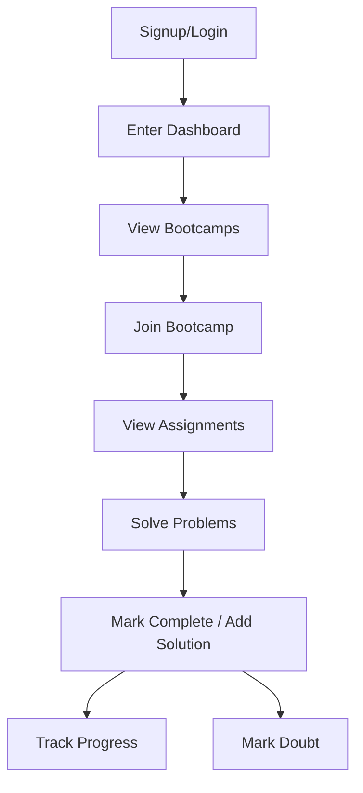
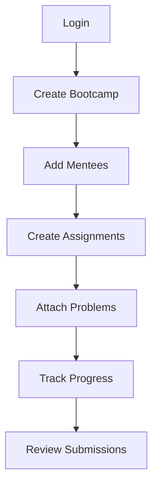
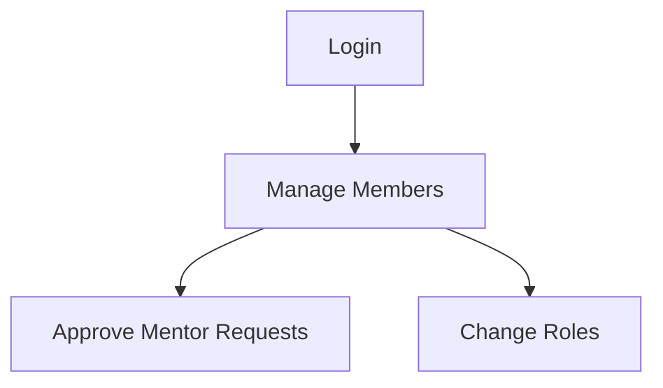

# Mentee Flow : 

Must for MVP : 
- View assigned problems
- Update status (pending → completed)
- Add solution link
- Mark doubt

```mermaid
flowchart TD
    A[Signup/Login] --> B[Enter Dashboard]
    B --> C[View Bootcamps]
    C --> D[Join Bootcamp]
    D --> E[View Assignments]
    E --> F[Solve Problems]
    F --> G[Mark Complete / Add Solution]
    G --> H[Track Progress]
    G --> I[Mark Doubt]
```

# Mentor Flow : 

```mermaid
flowchart TD
    A[Login] --> B[Create Bootcamp]
    B --> C[Add Mentees]
    C --> D[Create Assignments]
    D --> E[Attach Problems]
    E --> F[Track Progress]
    F --> G[Review Submissions]
```

# Admin 

```mermaid
flowchart TD
    A[Login] --> B[Manage Members]
    B --> C[Approve Mentor Requests]
    B --> D[Change Roles]
```